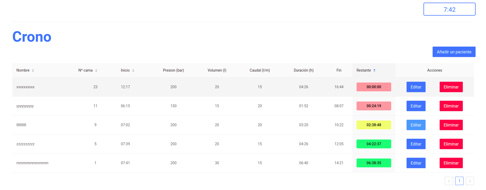
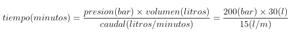
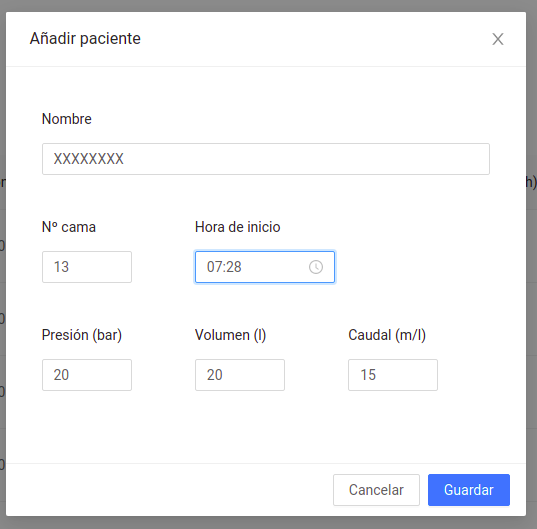
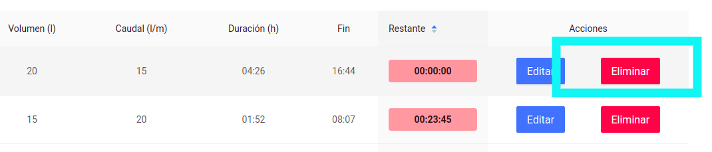
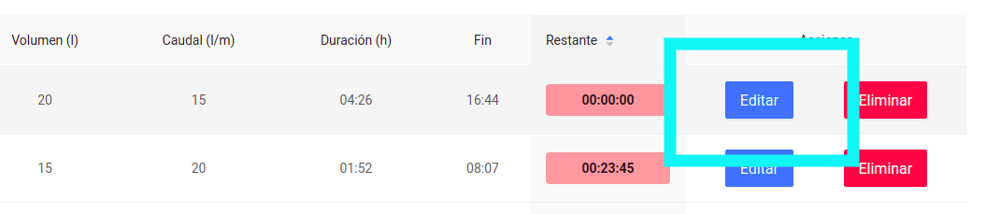
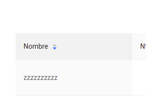
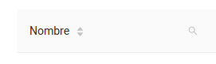

# Oxygen Crono

El objetivo de esta aplicación es poder monitorizar bombones o botellas de oxígeno y poder controlar el tiempo de uso de cada una.
Este tiempo de uso se calcula en función de algunos parámetros, como son, la presión a la que quiero aplicar el oxígeno, el volumen de la bombona y el caudal.

## ¿Cómo funciona?

### Añadir un registro(paciente)

1. Pulsar sobre botón **"Añadir paciente"** situado en la esquina superior derecha del panel principal.
2. Se desplegará un formulario donde debes añadir los datos para monitonizar un bombona en concreto.

   

3. Recuerda introducir los datos en la unidades correctas:
   - Unidad de presión: **bar**
   - Unidad de volumen: **litros**
   - Unidad de caudal: **litros/minuto**

### Eliminar registro

1. Pulsar sobre el botón **"Eliminar"** del registro en concreto que quieres eliminar.

   

### Actualizar un registro

1. Pulsar sobre el botón **"Editar"** del registro en concreto que quieres eliminar.

   

2. Se desplegará de nuevo el formulario.
3. Modifica el campo del formulario que quieras actualizar
4. Pulsa "Actualizar"

### Ordenar registros

Los registros estań ordenados en funcioń del tiempo restante y en sentido ascendente por defecto.
Esto quiere decir que se colocarán primero los registros cuyas bombonas o botellas de oxígeno están próxima a acabarse.

Puedes cambiar el orden de los registros por **nombre**, **Nº de cama**, **Hora de inicio** y **Tiempo restante**, pulsando sobre el nombre del campo.

### Filtrar registros

Existe la posibilidad de filtrar por **Nombre** y **Nº de cama**. Esto nos permite buscar un registro (paciente o cama) en concreto.
Para eso pulsa en el icono de **lupa** que existe en el nombre de los respectivos campos.

## Scripts disponibles

En el directorio del proyecto puedes ejecutar:

- Ejecutar la aplicación en desarrollo: `yarn start`
- Lanzar los test: `yarn test`
- Construir la aplicación para producción: `yarn build`
